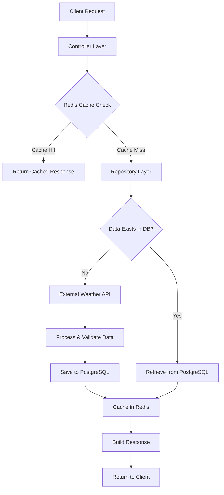

# Stormlight Weather API

A comprehensive weather API service that aggregates data from multiple official weather services including NOAA NWS and international sources, with built-in geocoding capabilities using the US Census Geocoder.

## Architecture

We follow a layered architecture to handle weather data requests through caching, external API integration, and database persistence.

### Requests

### Layers

#### Controllers

- HTTP request handling and validation
- Parameter parsing (coordinates, time ranges, pagination)
- Response formatting and error handling
- Interface between HTTP and business logic

#### Cache Layer

- Time-sensitive request caching for weather data
- Configurable TTL based on data type:
    - Current weather: 10-15 minutes
    - Forecasts: 30-60 minutes
    - Static location data: 24 hours
- Cache key strategy: `{endpoint}:{hash(params)}:{timestamp}`

#### Repositories

- Data access abstraction with PostgreSQL backend
- CRUD operations for forecasts, cities, and places
- Geospatial queries for location-based searches
- Batch operations for external API data ingestion

#### Providers

- External weather service integration (NOAA, Met.no, etc.)
- Rate limiting and API key management
- Data normalization across different weather sources
- Retry logic and fallback mechanisms

### Storage

- **Hot Data (Redis)**
    - Recent weather requests and responses
    - User session data and API rate limits
    - Frequently accessed location lookups
    - Temporary processing state for batch operations
- **Warm Data (PostgreSQL)**
    - Historical weather data and forecasts
    - Location database (cities, places, geocoding results)
    - User preferences, aggregated metrics & stats
- **Cold Data Strategy**
    - Archive old forecast data beyond retention period
    - Compress historical weather patterns for trend analysis

### Cache-First

1. **Request Processing**: Controllers check Redis cache before database queries
2. **Cache Population**: Database results are automatically cached with appropriate TTL
3. **Invalidation Strategy**: Time-based expiration with manual invalidation for critical updates
4. **Fallback Handling**: Graceful degradation when cache is unavailable

### Consistency

- **Static (Cities, Places)**
    - Cached indefinitely with manual invalidation
    - Updated through administrative endpoints
    - Eventual consistency acceptable for location data
- **Dynamic (Weather, Forecasts)**
    - Short-lived cache to balance freshness and performance
    - External API calls are rate-limited and batched when possible
    - Database serves as source of truth for historical data
- **Write-Through**
    - New weather data written to database immediately
    - Cache updated synchronously to maintain consistency
    - Background jobs (goroutines) handle bulk data ingestion from external APIs

## Toolchain

Structured logging with `charmbracelet/log`

`swaggo` for OpenAPI docs

Github OAuth

Postgres & KeyDB/Redis (Request Caching)

## Data Sources

| Source                 | Description                                            | Coverage                | Notes                                                                                                                       |
| :--------------------- | :----------------------------------------------------- | :---------------------- | :-------------------------------------------------------------------------------------------------------------------------- |
| **NOAA (NWS)**         | US National Weather Service (official US weather data) | USA only                | For US forecasts, alerts, radar. [API](https://www.weather.gov/documentation/services-web-api)                              |
| **Met.no (Yr API)**    | Norwegian Meteorological Institute, "met.no"           | Global                  | Very popular (used by open-meteo, car apps, etc). [API](https://api.met.no/weatherapi/documentation) - attribution required |
| **DWD**                | Deutscher Wetterdienst (Germany)                       | Germany + global models | [Open Data](https://opendata.dwd.de/) FTP downloads; no JSON API directly                                                   |
| **ECMWF**              | European Centre for Medium-Range Weather Forecasts     | Global (weather models) | Requires some access setup for APIs                                                                                         |
| **Environment Canada** | Canadian Meteorological Data                           | Canada                  | [Weather API Guide](https://weather.gc.ca/mainmenu/about_envcan_e.html) (RSS/XML mostly)                                    |
| **MeteoSwiss**         | Swiss Meteorological Data                              | Switzerland             | [Data](https://www.meteoswiss.admin.ch/) - mostly local                                                                     |
| **Copernicus (EU)**    | Satellite data (climate, atmospheric data)             | Global                  | [Open Access Hub](https://scihub.copernicus.eu/)                                                                            |

---

| Source                        | Description                              | Coverage                | Notes                                                                                                                          |
| :---------------------------- | :--------------------------------------- | :---------------------- | :----------------------------------------------------------------------------------------------------------------------------- |
| **Nominatim (OpenStreetMap)** | Open-source geocoding engine             | Global                  | Can self-host, no cost. Respect rate limits if public instance. [Docs](https://nominatim.org/release-docs/develop/api/Search/) |
| **US Census Geocoder**        | US address geocoding                     | USA only                | [API](https://geocoding.geo.census.gov/geocoder/)                                                                              |
| **Geonames**                  | Open geodata (cities, places, elevation) | Global                  | Free with attribution. [API](http://www.geonames.org/export/web-services.html)                                                 |
| **Natural Earth Data**        | Static global country/city boundaries    | Global                  | [Data](https://www.naturalearthdata.com/) (not an API, but for static data)                                                    |
| **GADM**                      | Administrative boundaries                | Global                  | Shapefiles for countries, provinces, etc.                                                                                      |
| **OpenAddresses**             | Open-source address points               | Global (some countries) | Raw dumps, no API. Self-hosting needed                                                                                         |

## CLI

### Encryption

The secrets package provides secure configuration management using AES-256-GCM encryption with scrypt key derivation for sensitive environment variables (see [`env.local`](env.local)).
Keys can be sourced from CLI arguments, environment variables, or interactive prompts, with built-in validation requiring 12+ characters, mixed case, digits, and forbidden pattern detection. Values are encrypted in a salt:nonce:ciphertext format, allowing seamless handling where non-encrypted values pass through unchanged while encrypted values are automatically decrypted when accessed.
